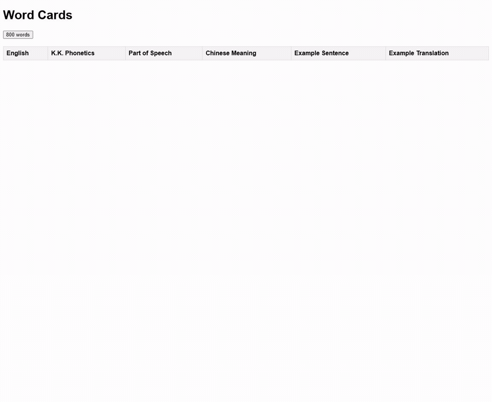

# English Test 4 Me

[English](README.md) | [繁體中文](README.zh-TW.md)

一個免登入、免安裝的瀏覽器英文練習工具，每次從國中進階 800 單字資料中隨機
選出 20 筆。

[開啟線上網站](https://whyren0324.github.io/engtest4me.github.io/)

## 解決什麼問題

靜態單字表適合查閱，但依固定順序閱讀容易記住位置，而不是單字本身。若只是想
完成一次短時間複習，使用者也不一定想管理試算表或安裝大型學習軟體。

English Test 4 Me 將既有 CSV 單字資料轉成簡單的瀏覽器練習：

- 每次隨機選出最多 20 個單字；
- 同時顯示英文、K.K. 音標、詞性、中文意思、例句及例句翻譯；
- 在例句中標示目標單字；以及
- 以純靜態網站執行，不需要帳號或後端資料庫。

## 操作示範

按下 **800 words**，即可產生一組新的 20 單字：



[開啟互動 Demo](https://whyren0324.github.io/engtest4me.github.io/)

## Before / After

| Before：靜態單字資料 | After：瀏覽器練習 |
|---|---|
| 在 CSV 中逐列閱讀 | 按一下按鈕產生 20 個單字 |
| 每次都以相同順序複習 | 每次取得不同的隨機組合 |
| 自行對照單字、音標、意思與例句 | 在同一張表格看到六項完整資料 |
| 使用本機試算表或文件 | 在現代瀏覽器中免登入練習 |

## 安裝方式

### 一般使用者

不需要安裝。使用現代瀏覽器開啟
[線上網站](https://whyren0324.github.io/engtest4me.github.io/) 即可。

### 本機開發

頁面使用 `fetch` 載入 `800.csv`，因此請透過 HTTP server 執行，不要直接開啟
`index.html`：

```powershell
git clone https://github.com/whyren0324/engtest4me.github.io.git
cd engtest4me.github.io
python -m http.server 8000
```

接著開啟 <http://localhost:8000/>。

## 使用方式

1. 開啟網站。
2. 按下 **800 words**。
3. 複習隨機選出的 20 筆單字資料。
4. 重新整理頁面，或再次按下 **800 words** 取得下一組。

目前介面會直接顯示所有答案；隱藏答案的測驗模式屬於未來功能。

## Roadmap

- 增加可隱藏中文意思或例句答案的正式測驗模式。
- 在不要求登入的前提下，於瀏覽器內記錄學習進度。
- 增加詞性、難度與題數篩選。
- 改善手機版面、無障礙及鍵盤操作。
- 在保留資料來源說明的前提下支援更多單字集。

Roadmap 是規劃方向，不代表已承諾發行日期。

## Todo

- [ ] 改用可處理 quoted commas 的 CSV parser。
- [ ] 在頁面中顯示空資料及格式錯誤訊息。
- [ ] 載入 CSV 時加入 loading 與停用按鈕狀態。
- [ ] 改善手機上的表格版面。
- [ ] 補上單字資料的精確來源與再利用條款。
- [ ] 自動檢查 CSV 欄位數量與必要欄位。

## 資料格式

目前練習讀取 `800.csv`。每一筆有效資料包含六個欄位：

1. 英文單字
2. K.K. 音標
3. 詞性
4. 中文意思
5. 英文例句
6. 例句翻譯

原始 README 將資料描述為「國中英語 800 單進階」。在擴大散布前，仍需補充
確切出版者、來源網址與再利用條款。

## 授權

本專案目前尚未宣告 License。加入 License 之前，原始碼雖可在 GitHub 上查看，
但不等同於已自動授權他人以開源方式再利用。
